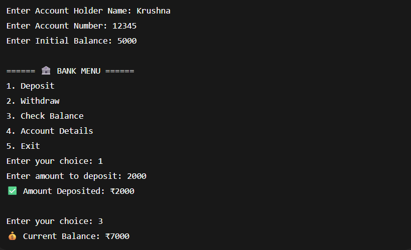

# 📅 Day 12 — Bank Account System

### Understanding OOP Concepts Using a Real-World Simulation

---

## 🔗 Quick Navigation

- [🎯 Goal of the Day](#-goal-of-the-day)
- [🧠 Concepts Practiced](#-concepts-practiced)
- [🏦 What I Built](#-what-i-built)
- [📁 Folder Structure](#-folder-structure)
- [⚙️ System Design Explained](#️-system-design-explained)
- [🖼️ Working Output](#️-working-output)
- [📝 Notes & Observations](#-notes--observations)
- [💡 Key Takeaways](#-key-takeaways)
- [🎯 Interview Preparation](#-interview-preparation-day-12-level)
- [⏭️ What’s Next?](#️-whats-next)

---

## 🎯 Goal of the Day

The goal of **Day 12** is to build a **Bank Account System** using **Object-Oriented Programming**.

This project focuses on:

- Designing a class
- Encapsulation
- Object creation
- Real-world simulation using Java

---

## 🧠 Concepts Practiced

### Core OOP Concepts

- Class & Object
- Encapsulation
- Instance variables
- Methods
- Constructor
- Data hiding

### Logical Skills

- Real-world mapping into code
- State management
- Method-driven operations

---

## 🏦 What I Built

A **console-based bank account system** where a user can:

✔ Create an account  
✔ Deposit money  
✔ Withdraw money  
✔ Check balance

📌 Object-oriented design  
📌 Real-world scenario  
📌 Clean method-based operations

---

## 📁 Folder Structure

Day-12-Bank-Account-System/
├── README.md  
├── NOTES.md  
├── assets/  
│ └── output.png  
└── src/  
 ├── BankAccount.java  
 └── BankApp.java

---

## ⚙️ System Design Explained

Create a `BankAccount` class with:

- accountHolderName
- accountNumber
- balance

Methods:

- deposit()
- withdraw()
- checkBalance()

Create object in main class and perform operations.

This demonstrates **data + behavior in a single unit (OOP core idea)**.

---

## 🖼️ Working Output

📸 Example run:

👉 View Output Screenshot

---

## 📝 Notes & Observations

OOP helps model real-world entities

Encapsulation protects account data

Methods define object behavior

State changes when deposit/withdraw is performed

---

## 💡 Key Takeaways

Everything in Java revolves around objects

Encapsulation improves security

Constructor initializes object state

This is the foundation for advanced OOP

---

## 🎯 Interview Preparation (Day 12 Level)

**Q1. What is encapsulation?**  
Binding data and methods into a single unit and restricting direct access.

**Q2. Why use a constructor?**  
To initialize object values at the time of creation.

**Q3. Why keep variables private?**  
To protect data from unauthorized access.

**Q4. Real-world use of this system?**  
Banking applications & financial systems.

---

## ⏭️ What’s Next?

### 👉 Day 13 – Student Management System (OOP + Arrays)

Focus areas:

Multiple objects  
Data storage  
Menu-driven system

 

[➡️ Go to Day 13](../Day-13/README.md)

---
