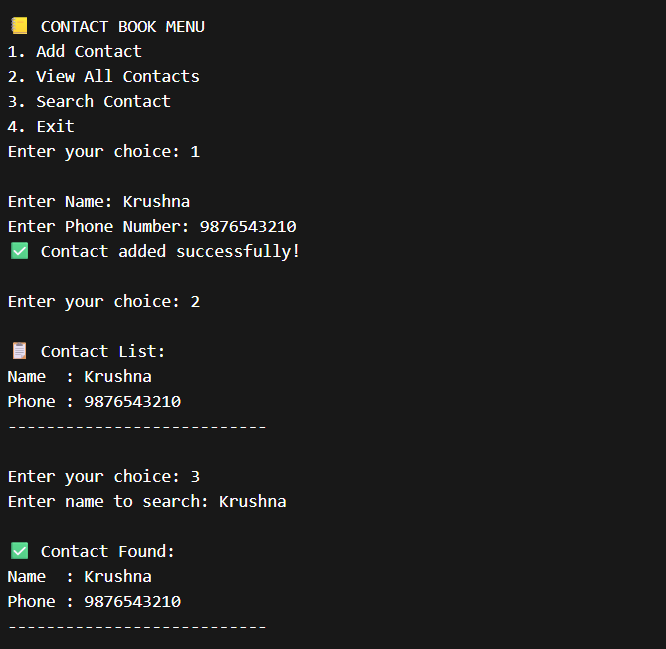

# 📅 Day 13 — Contact Book System

### Managing Multiple Records Using Arrays & Menu-Driven Program

---

## 🔗 Quick Navigation

- [🎯 Goal of the Day](#-goal-of-the-day)
- [🧠 Concepts Practiced](#-concepts-practiced)
- [📒 What I Built](#-what-i-built)
- [📁 Folder Structure](#-folder-structure)
- [⚙️ System Logic Explained](#️-system-logic-explained)
- [🖼️ Working Output](#️-working-output)
- [📝 Notes & Observations](#-notes--observations)
- [💡 Key Takeaways](#-key-takeaways)
- [🎯 Interview Preparation](#-interview-preparation-day-13-level)
- [⏭️ What’s Next?](#️-whats-next)

---

## 🎯 Goal of the Day

The goal of **Day 13** is to build a **Contact Book System** that can:

- Store multiple contacts
- Display all contacts
- Search a contact
- Use a menu-driven interface

This project introduces **data management using arrays**.

---

## 🧠 Concepts Practiced

### Core Java Concepts

- Arrays of objects
- Menu-driven programs
- Loops
- Conditional statements
- Class & Object

### Logical Skills

- Managing multiple records
- Searching data
- User-driven program flow

---

## 📒 What I Built

A **console-based contact book** where a user can:

✔ Add new contact  
✔ View all contacts  
✔ Search contact by name  
✔ Exit the system

📌 Stores multiple records  
📌 Real-world simulation  
📌 Structured data handling

---

## 📁 Folder Structure

Day-13-Contact-Book/
├── README.md  
├── NOTES.md  
├── assets/  
│ └── output.png  
└── src/  
 ├── Contact.java  
 └── ContactBookApp.java

---

## ⚙️ System Logic Explained

Create a `Contact` class with:

- name
- phoneNumber

Store multiple contact objects inside an array

Use a menu to:

1 → Add contact  
2 → View all contacts  
3 → Search contact  
4 → Exit

Traverse array to display and search records.

This demonstrates **record management without collections**.

---

## 🖼️ Working Output

📸 Example run:

👉 View Output Screenshot

---

## 📝 Notes & Observations

Arrays can store multiple objects

Menu-driven programs simulate real applications

Searching requires traversal

Structured storage improves clarity

---

## 💡 Key Takeaways

This is your first multi-record system

Arrays act as a basic database

Object arrays are powerful

Logic becomes closer to real software

---

## 🎯 Interview Preparation (Day 13 Level)

**Q1. Why use an array of objects here?**  
To store multiple contact records.

**Q2. How does searching work?**  
By traversing the array and matching names.

**Q3. What are the limitations of arrays?**  
Fixed size.

**Q4. What is the better alternative in real applications?**  
ArrayList or database.

---

## ⏭️ What’s Next?

### 👉 Day 14 – To-Do List (ArrayList + OOP)

Focus areas:

Dynamic storage  
Collections framework  
Real task manager logic

 

[➡️ Go to Day 14](#-day-14--to-do-list-arraylist--oop)

---
