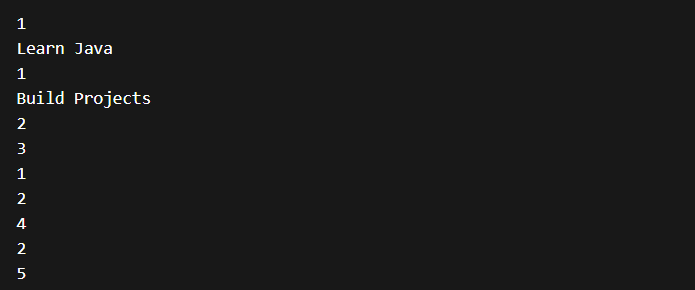

# 📅 Day 14 — To-Do List Manager

### Building a Real Task Manager Using ArrayList & OOP

---

## 🔗 Quick Navigation

- [🎯 Goal of the Day](#-goal-of-the-day)
- [🧠 Concepts Practiced](#-concepts-practiced)
- [📝 What I Built](#-what-i-built)
- [📁 Folder Structure](#-folder-structure)
- [⚙️ System Logic Explained](#️-system-logic-explained)
- [🖼️ Working Output](#️-working-output)
- [📝 Notes & Observations](#-notes--observations)
- [💡 Key Takeaways](#-key-takeaways)
- [🎯 Interview Preparation](#-interview-preparation-day-14-level)
- [⏭️ What’s Next?](#️-whats-next)

---

## 🎯 Goal of the Day

The goal of **Day 14** is to build a **To-Do List Manager** that allows:

- Adding tasks
- Viewing all tasks
- Marking tasks as completed
- Deleting tasks

This project introduces **dynamic data storage using ArrayList**.

---

## 🧠 Concepts Practiced

### Core Java Concepts

- ArrayList
- Class & Object
- Encapsulation
- Loops
- Menu-driven program

### Logical Skills

- CRUD operations
- Dynamic record handling
- Index-based operations

---

## 📝 What I Built

A **console-based task manager** where a user can:

✔ Add a task  
✔ View all tasks  
✔ Mark task as completed  
✔ Delete a task  
✔ Exit

📌 Dynamic storage using ArrayList  
📌 Real-world productivity application  
📌 Clean OOP structure

---

## 📁 Folder Structure

Day-14-ToDo-List-Manager/  
├── README.md  
├── NOTES.md  
├── assets/  
│ └── output.png  
└── src/  
 ├── Task.java  
 └── ToDoListApp.java

---

## ⚙️ System Logic Explained

Create a `Task` class with:

- taskName
- isCompleted

Store tasks inside an `ArrayList<Task>`.

Menu operations:

1 → Add task  
2 → View tasks  
3 → Mark task as completed  
4 → Delete task  
5 → Exit

ArrayList allows:

Dynamic growth  
Easy deletion  
Index-based updates

This simulates **real task manager behavior**.

---

## 🖼️ Working Output

📸 Example run:

👉 View Output Screenshot

---

## 📝 Notes & Observations

ArrayList removes fixed-size limitation of arrays

CRUD operations make programs real-world ready

Index handling is important in dynamic data

Encapsulation keeps task structure clean

---

## 💡 Key Takeaways

This is your first **collections-based application**

Dynamic storage is essential for scalable systems

This project is similar to real productivity apps

You are now writing **resume-level Java programs**

---

## 🎯 Interview Preparation (Day 14 Level)

**Q1. Why use ArrayList instead of an array?**  
Because it can grow dynamically.

**Q2. What is CRUD?**  
Create, Read, Update, Delete.

**Q3. How do you mark a task as completed?**  
By updating the object using its index.

**Q4. Why use a separate Task class?**  
To follow OOP and store structured data.

---

## ⏭️ What’s Next?

### 👉 Day 15 – Mini Library System (OOP + ArrayList)

Focus areas:

Multiple objects  
Issue & return logic  
Real-world system design

 

➡️ Go to Day 15

---
