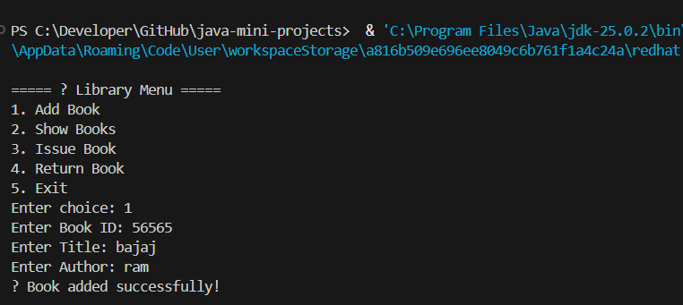

<div align="center">

# 📅 Day 15 — Library Management System

### Designing a Real-World Console Application Using OOP & ArrayList


</div>

---

## 🔗 Quick Navigation

- [🎯 Goal of the Day](#-goal-of-the-day)
- [🧠 Concepts Practiced](#-concepts-practiced)
- [🏛 What I Built](#-what-i-built)
- [📁 Folder Structure](#-folder-structure)
- [⚙️ System Logic Explained](#️-system-logic-explained)
- [🖼️ Working Output](#️-working-output)
- [📝 Notes & Observations](#-notes--observations)
- [💡 Key Takeaways](#-key-takeaways)
- [🎯 Interview Preparation](#-interview-preparation-day-15-level)
- [⏭️ What’s Next?](#️-whats-next)

---

## 🎯 Goal of the Day

The goal of **Day 15** is to build a **Library Management System** that simulates real-world operations:

- Add books
- View available books
- Issue a book
- Return a book

This project focuses on **multi-class OOP design and object interaction**.

---

## 🧠 Concepts Practiced

### Core Java Concepts

- Class & Object
- Encapsulation
- ArrayList
- Method-based design
- Menu-driven program
- Object state update

### OOP Design Concepts

- Entity modeling (`Book` class)
- Data management using a separate manager class
- Separation of concerns

---

## 🏛 What I Built

A **console-based Library Management System** where:

✔ Books are stored as objects  
✔ Library operations are method-driven  
✔ Book issue/return updates object state  
✔ Dynamic storage using ArrayList

📌 Real-world system simulation  
📌 Clean class interaction  
📌 Scalable design approach

---

## 📁 Folder Structure

Day-15-Library-Management-System/
├── README.md  
├── NOTES.md  
├── assets/  
│ └── output.png  
└── src/  
 ├── Book.java  
 ├── Library.java  
 └── LibraryApp.java

---

## ⚙️ System Logic Explained

### 📘 Book Class

Represents:

- bookId
- bookName
- authorName
- isIssued

This class:

- Stores book data
- Controls issue status

---

### 🏢 Library Class

Responsible for:

- Adding books
- Displaying books
- Issuing books
- Returning books

Uses:

```java
ArrayList<Book>

for dynamic storage.

🖥 LibraryApp (Main Class)

Provides:

Menu

User interaction

Method calls to Library

```

## 🔄 Issue Book Flow

User enters book ID

System searches the book

If available → mark as issued

Update status

## 🔁 Return Book Flow

User enters book ID

System finds issued book

Mark as returned

This demonstrates real object state transition.

## 🖼️ Working Output

📸 Example run:

👉 View Output Screenshot



## 📝 Notes & Observations

This is the first multi-class structured application

Real systems are built using object collaboration

Separating Book and Library improves scalability

Menu-driven design simulates real software behavior

## 💡 Key Takeaways

OOP is used to model real-world systems

ArrayList enables dynamic data handling

State change inside objects is powerful

This project is resume-worthy

You are now writing system-style Java programs

## 🎯 Interview Preparation (Day 15 Level)

Q1. Why create a separate Book class?
To represent a real-world entity and store structured data.

Q2. Why use ArrayList instead of an array?
Because the number of books is dynamic.

Q3. How is a book issued?
By updating the isIssued status of the object.

Q4. What OOP principle is used here?
Encapsulation and abstraction.

Q5. How can this system be improved?

User login system

File/database storage

Search functionality

Due date & fine calculation

## ⏭️ What’s Next?

<div align="center">
👉 Day 16 – Student Management System (OOP + Collections)

Focus areas:

Multiple object handling
Search & update operations
Data filtering
Real-world record management

<br/>

[➡️ Go to Day 16](#-day-16-Student-Management-System)

</div>
```
